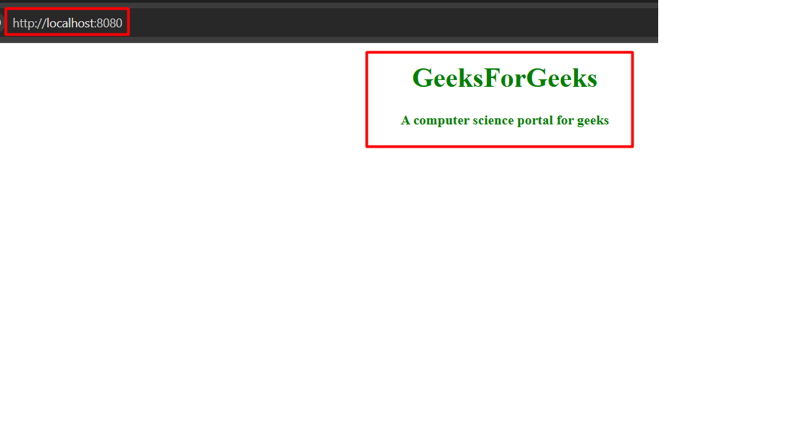

1) Create new project folder and rename as you like, for example react-app

2) Check your **node version (node -v)** and update if necessary to the latest version

3) Open terminal or command prompt, go to your **react app folder**, and run this
   command:

    ```
    npm init -y
    ```

    - this will create the project package.json, that will contain all the 
    dependencies when we run npm install later

    - type: code . to open the project folder in VSCode, you can check out the 
    package.json file

4) In **VSCode**, create **.gitignore** file to ignore node_modules when commiting to github.
   Open .gitignore file and add the following line then save:
   
   **node_modules/**

   Commit your .gitignore file to your repository:

    ```
    git add .gitignore && git commit -m "Add .gitignore with node_modules"
    ```

   or use the git utilities in VSCode to commit

5) Make two directories named "public" and "src" inside the project directory
    - **"public"** folder contains all static assets like images, svgs, etc
      and an index.html file where the react will render our app

    - **"src"** folder contains the whole source code

6) Inside the public folder, make a file named **index.html**. 
   Copy the following html code into index.html

    ```
    <!DOCTYPE html>
    <html lang="en">
        <head>
            <meta charset="UTF-8">
            <meta http-equiv="X-UA-Compatible" content="IE=edge">
            <meta name="viewport" content=
                "width=device-width, initial-scale=1.0">
            <title>Basic Boilerplate of React</title>
        </head>
        <body>

            <!-- This is the div where React 
                will render our app -->
            <div id="root"></div>
            <noscript>
                Please enable javascript to view this site.
            </noscript>
            <script src="../dist/bundle.js"></script>
        </body>
    </html>
    ```

7) Install **babel** (in terminal) to allow ES6 on older browser and to compile **JSX
   (Javascript XML)** into **vanilla javascript**

    ```
    npm install --save-dev @babel/core @babel/cli @babel/preset-env @babel/preset-react
    ```

    Here:

    **–save-dev** means save all above installed modules in devDependencies in package.
     json file,

    **@babel/core** is a module that contains the main functionality of Babel,

    **@babel/cli** is a module that allows us to use babel from the terminal,

    **@babel/preset-env** is preset that handles the transformation of ES6 syntax into
    common javascript,

    **@babel/preset-react** is preset which deals with JSX and converts it into vanilla
    javascript.

8) Now, create a file **".babelrc"** in the root directory. This file will tell babel
   transpiler what presets and plugins to use to transpile the code. 
   Add the following JSON code:

    ```
    {
        "presets": ["@babel/preset-env","@babel/preset-react"]
    }
    ```

9) Install **React** and **React DOM** by running the following command on the terminal:

    ```
    npm i react react-dom
    ```

10) Create three files inside "src" folder:
    
    **"App.js", "index.js", "App.css"**

11) Add the following code:

    in **App.js** (A component of React - you can create any number of react component)

    ```
    //note the ES6 arrow function and export default

    import React from "react";
    import "./App.css";
    const App = () => {
        return (
            <div>
                <h1 className="heading">GeeksForGeeks</h1>
                <h4 className="sub-heading">
                    A computer science portal for geeks
                </h4>
            </div>
        );
    };

    export default App;   
    ```

    in **App.css** (Provides stylings for App component)

    ```
    /* stylings for App component */
    .heading,.sub-heading{
        color:green;
        text-align: center;
    }    
    ```

    in **index.js** 
        (Renders the components on the browser inside index.html - DOM "root")

    ```
    import React from "react";
    import { createRoot } from 'react-dom/client';

    import App from "./App";

    const root = createRoot(document.getElementById('root'));
    root.render(<App />);    
    ```

12) Install **webpack** a local development server for the project with live reloading

    ```
    npm install --save-dev webpack webpack-cli webpack-dev-server
    ```

    **webpack** is a modular bundler

    **webpack-cli** allows us to use webpack from the terminal by running 
    a set of commands,

    **webpack-dev-server** provides a development server with live reloading
    i.e. you do not need to refresh the page manually.

    NOTE: 
        * webpack takes code from the src directory and perform required operations
            * like bundling of code, 
            * conversion of ES6 syntax and 
            * JSX syntax 
        * into common javascript etc. and host the public directory 
        * so that we can view our app in the browser (the index.html).

13) Webpack can understand JavaScript and JSON files only. So, to use webpack
    functionality in other files like .css, babel files, etc., we have to install
    some loaders in the project by writing the following command on the terminal:

    ```
    npm i --save-dev style-loader css-loader babel-loader
    npm i -D babel-loader
    ```

    **css-loader** collects CSS from all the CSS files in the app and bundle it 
    into one file

    **style-loader** puts all stylings inside <style> tag in index.html file present 
    in the public folder

    **babel-loader** is a package that allows the transpiling of javascript files 
    using babel and webpack.

14) Create a **webpack.config.js** file in the root directory that helps us 
    to define what exactly the webpack should do with our source code. 
    We will specify the entry point from where the webpack should start bundling,
    the output point that is where it should output the bundles and assets, 
    plugins, etc.

    **webpack.config.js**

    ```
    const path = require("path");

    module.exports = {

    // Entry point that indicates where
    // should the webpack starts bundling
    entry: "./src/index.js",
    mode: "development",
    module: {
        rules: [
            {
                test: /\.(js|jsx)$/, // checks for .js or .jsx files
                exclude: /(node_modules)/,
                loader: "babel-loader",
                options: { presets: ["@babel/env"] },
            },
            {
                test: /\.css$/, //checks for .css files
                use: ["style-loader", "css-loader"],
            },
        ],
    },

    // Options for resolving module requests
    // extensions that are used
    resolve: { extensions: ["*", ".js", ".jsx"] },

    // Output point is where webpack should
    // output the bundles and assets
    output: {
        path: path.resolve(__dirname, "dist/"),
        publicPath: "/dist/",
        filename: "bundle.js",
    },
    };
   
    ```

15) Add some scripts in the **package.json** file to run and build the project.

    ```
    "scripts": {
        "start":"npx webpack-dev-server --mode development --open --hot",
        "build":"npx webpack --mode production",

    }    
    ```
    **start** is to run the project

    **–open** flag tells the webpack-dev-server to open the browser instantly 
    after the server had been started.

    **–hot** flag enables webpack’s Hot Module Replacement feature. 
    It only updates what’s changed in the code, so does not update 
    the whole code,
    again and again, that’s why it saves precious development time

    **NPM command to run our project:**

    ```
    npm start
    ```

    **build** is to deply to production and compile all the project file
    in the **dist** folder

    **NPM command to deploy project for production**

    ```
    npm run build
    ```

16) To create your own react project using this **boilerplate**, you need to:

    - clone the project into your computer, by running this git command:

    ```
    git clone https://github.com/roselykm/beginner-react-boilerplate.git your-react-project-name
    ```

    - go into your your-react-project-name folder

    - **Execute**:
        ```
        npm install
        npm start
        ```

    - **output**

    

